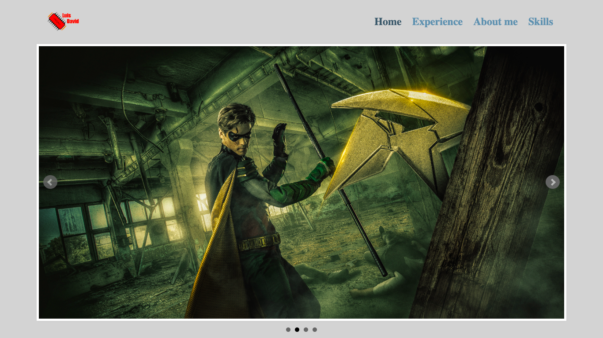

# Portfolio Template

## Table of contents

- [Overview](#overview)
  - [The challenge](#the-challenge)
  - [Screenshot](#screenshot)
- [My process](#my-process)
  - [Built with](#built-with)
  - [What I learned](#what-i-learned)
  - [Continued development](#continued-development)
- [Author](#author)

## Overview

### The challenge

Users should be able to:

- View the page from any device of different size
- See a functional slider with 3 images included
- See a template of unprotected skills.
- View a navbar that does not contain redirects

### Screenshot

## My process

### Built with

- HTML
- CSS
- bxSlider plugin

### What I learned

In this project I learned to integrate a pack of icons that are imported through a url with the link tag, also to include a javascript plugin which allows you to make a slider in a simple way, only using specific classes and entering the images in a list , finally I learned how to make cls layouts using float to move the content.

### Continued development

Something that can be developed is to include more subs to make a fully functional navbar with redirection, in addition to applying a little more styles with media queries so that it adapts better to mobile devices.

## Author

Luis David Jimenez Martinez
- Portfolio - [www.luisdavidjm.com](https://www.luisdavidjm.com)
- GitHub - [LuisDavidJM](https://github.com/LuisDavidJM)
